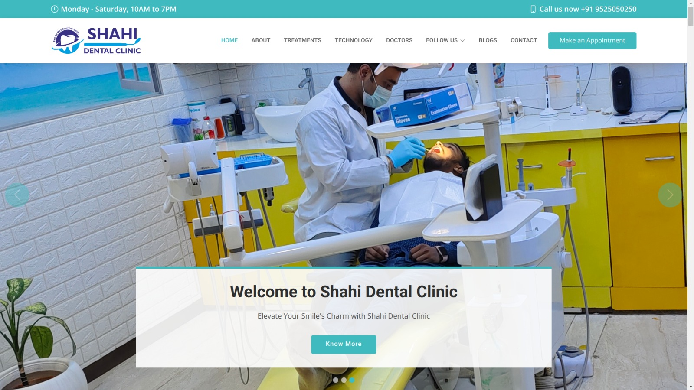

# Welcome to the Dental Clinic Website!



We're excited to introduce you to our state-of-the-art Dental Clinic Website, designed and developed using HTML, CSS, JavaScript, and Bootstrap. Our website not only provides information about our clinic and services but also offers a convenient appointment booking system. Additionally, we've integrated a seamless backend using Google Apps Script, allowing form data to be stored securely in a Google Sheet for efficient management.

## Table of Contents

- [Features](#features)
- [Screenshot](#screenshot)
- [Live Demo](https://nimish-nimishmittal.github.io/frontend-bootstrap/)
- [Getting Started](#getting-started)
  - [Prerequisites](#prerequisites)
  - [Installation](#installation)
- [Usage](#usage)
- [Backend Integration](#backend-integration)
- [Contributing](#contributing)
- [License](#license)

## Features

- **Responsive Design:** Our website is built using Bootstrap, ensuring a seamless experience across various devices and screen sizes.

- **Service Information:** Learn about the comprehensive range of dental services we offer, from routine check-ups to advanced treatments.

- **Meet the Team:** Get to know our highly skilled and friendly dental professionals who are dedicated to patient care.

- **Appointment Booking:** Book appointments online at your convenience, with real-time availability updates.

- **Patient Resources:** Access helpful resources and information to maintain optimal dental health.

- **Contact Us:** Reach out to us easily via the contact form provided.

## Screenshot


## Live Demo

Experience the Dental Clinic Website live: [View Live Demo](https://nimish-nimishmittal.github.io/frontend-bootstrap/)

## Getting Started

### Prerequisites

To run the website locally, you'll need:

- Web browser (Google Chrome, Mozilla Firefox, Safari, etc.)
- Text editor or Integrated Development Environment (IDE)
- Node.js (for development purposes)

### Installation

1. **Clone the repository:**

   ```bash
   git clone https://github.com/your-username/dental-clinic-website.git
   ```

2. **Navigate to the project folder:**

   ```bash
   cd dental-clinic-website
   ```

3. **Open the project in your preferred text editor or IDE.**

## Usage

Simply open the `index.html` file in your web browser to explore the Dental Clinic Website. Navigate through the pages using the menu and experience the user-friendly interface designed to provide you with all the information you need.

## Backend Integration

Our website's backend is seamlessly integrated using Google Apps Script. When users fill out the appointment booking form, their data is securely sent to a Google Sheet, allowing our team to efficiently manage appointments and provide better patient care.

## Contributing

We welcome contributions to enhance the Dental Clinic Website's features and functionality. If you'd like to contribute, please follow these steps:

1. Fork the repository.
2. Create a new branch.
3. Make your enhancements or fixes.
4. Test thoroughly.
5. Create a pull request explaining your changes.

## License

This project is licensed under the [MIT License](LICENSE).

---

Thank you for choosing our Dental Clinic Website. We are dedicated to delivering the best dental care experience to our patients, both online and offline. If you have any questions or feedback, please don't hesitate to [contact us](nimishmittal.3072191.aesl@gmail.com). Your smile is our priority! 😁🦷
